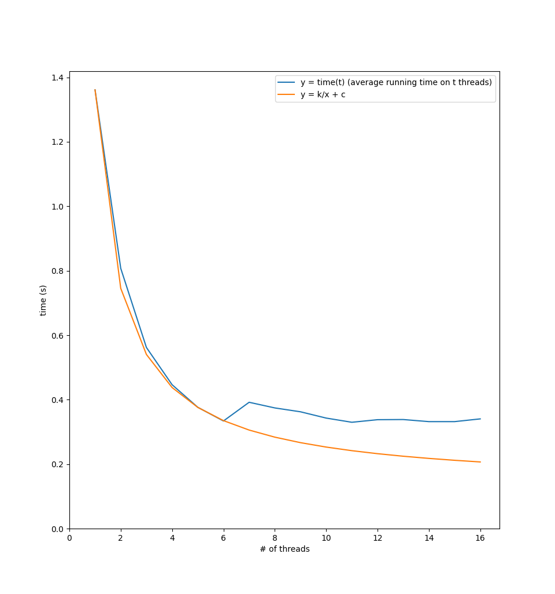

# Usage
Build the executable: `scrpits/build.sh` \
Run it: `./dpnum [-s range_start] [-e range_end] [-t thread_count] [-v]` \
Test execution time with different number of threads: `scripts/test.sh` \
Produce the plot below: `python3 scripts/plot.py`

# Results
I ran `dpnum` on the range $[1; 1.000.000]$ with the number of threads $t$ varying from $1$ to $16$. \
I also repeated every experiment $20$ times and computed the average running time. \
Here are the results:

We can see that with $t \leq 6$, $time(t)$ is approximately $\frac{k}{t} + c$, meaning that operations that cannot be paralleled take \
$c$ seconds (here $c \approx 0.13$), while operations that can be paralleled take $k$ seconds and are distributed between threads. \
However, when $t > 6$, execution time stays relatively constant. This is because my laptop has $8$ cores. Assuming $2$ cores \
are busy running the system and other applications, the remaining $6$ cores are used in `dpnum`. If we use more than $6$ \
threads, still no more than $6$ cores will be used, so increasing $t$ further won't improve performance.
